<!-- ════════════════════════ HERO ════════════════════════ -->

  

  

<!-- ════════════════════════ PRIMARY CTA ════════════════════════ -->

  
  &nbsp;
  

  
  &nbsp;
  

 

<!-- ════════════════════════ INTRO ════════════════════════ -->
## 👋 Hi, I'm Haroon

I help founders and small teams with two things: automating the repetitive work that eats their time, and turning ideas into real products people can use.

On the automation side I build AI agents and workflows with tools like n8n, LangChain, LangGraph and Claude. On the product side I build and ship full apps with Next.js, FastAPI and Python. If you have an idea or a process that keeps slowing you down, I can probably help.

 

<!-- ════════════════════════ WHAT I HELP WITH ════════════════════════ -->
## 💼 What I help with

<table>
  <tr>
    <td width="50%" valign="top">
      <h3>🤖 AI automation and agents</h3>
      I set up AI agents and workflows that connect your tools and handle the repetitive work, so your team can focus on the parts that actually need a person.
    </td>
    <td width="50%" valign="top">
      <h3>🚀 Idea to MVP or SaaS</h3>
      I take an idea and build it into a working product in a few weeks, so you can put it in front of real users and see what sticks before spending big.
    </td>
  </tr>
  <tr>
    <td width="50%" valign="top">
      <h3>🧠 AI and ML features</h3>
      I add things like chatbots and smart search into your product in a way that is reliable and easy to maintain, not just a flashy demo.
    </td>
    <td width="50%" valign="top">
      <h3>🤝 Ongoing tech partner</h3>
      If you would rather not manage a project one task at a time, I can work with you over the long run and keep improving things as you grow.
    </td>
  </tr>
</table>

 

<!-- ════════════════════════ HOW I WORK ════════════════════════ -->
## 🧭 How I work

| 1. Understand | 2. Plan | 3. Build | 4. Ship |
|:---:|:---:|:---:|:---:|
| We talk through the goal and who it is for | I scope a simple version that gets you there fastest | I build it with regular check-ins so there are no surprises | We launch, see how it does, and improve from there |

 

<!-- ════════════════════════ TECH ════════════════════════ -->
## 🛠️ Tools I use

AI and automation

Backend

Frontend

Infra and tools

 

<!-- ════════════════════════ FEATURED WORK ════════════════════════ -->
## 🏆 Some things I've built

<!-- TODO (Haroon): add real links (Live / Code) under each project, and a metric line if you have one. -->

<table>
  <tr>
    <td width="50%" valign="top">
      <h3>FocusBlade</h3>
      An AI-powered task manager that helps you plan your day and stay focused on what actually matters.
        
      AI task manager · add link
    </td>
    <td width="50%" valign="top">
      <h3>ArenaOps</h3>
      A management platform for sports complexes that keeps bookings, teams, and daily operations in one place.
        
      SaaS platform · add link
    </td>
  </tr>
</table>

 

<!-- ════════════════════════ TESTIMONIAL ════════════════════════ -->
## 💬 What clients say

<!-- Verified client reviews from Upwork. TODO (Haroon): double-check wording matches your profile exactly. -->

<table>
  <tr>
    <td width="50%" valign="top">
      "Haroon is an all star!"
        
      Jim · MVP Development · via Upwork
    </td>
    <td width="50%" valign="top">
      "Very consistent and reliable. High quality with excellent attention to detail."
        
      Mark Buckingham · AI Services · via Upwork
    </td>
  </tr>
  <tr>
    <td width="50%" valign="top">
      "Excellent at communicating and anticipating needs. The project was delivered on time and on budget."
        
      Jacob Lutz · MVP Development · via Upwork
    </td>
    <td width="50%" valign="top">
      "Great communication and deep craft knowledge over a long-term project, and always willing to adapt."
        
      Alan Nagar · SaaS Development · via Upwork
    </td>
  </tr>
</table>

 

<!-- ════════════════════════ STATS ════════════════════════ -->
## 📊 A bit about my GitHub

  
  

  

  

 

<!-- ════════════════════════ CONTACT ════════════════════════ -->
## 📬 Let's talk

Have an idea, a process that keeps slowing you down, or a product you want to get off the ground? Send me a message. The first call is free, and there is no pressure.

  
  &nbsp;
  
  &nbsp;
  

  <!-- TODO: replace with your real LinkedIn / X handles -->
  
  
  

Thanks for stopping by.

